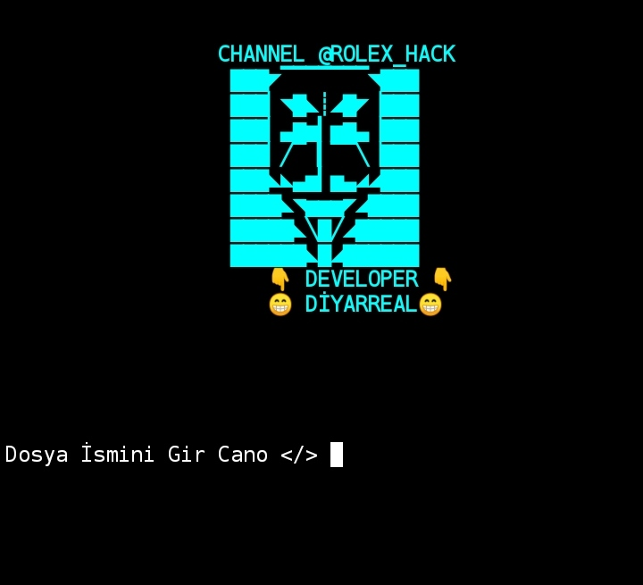

<h1 align="center">ZipCrack v1.0</h1>

# Zipcrack
zip dosyalarının şifresini kırmak.

# Tested on
- Kali Linux
- Ubuntu
- Termux

<h2 align="center">🔗 Contact and Social Media Accounts</h2>

  
  
  
  

# Kurulum
* apt install python3

* apt install git

* git clone https://github.com/aynencano153/zipcrack
* cd zipcrack

* python3 zipcrack.py

Daha fazla bilgi için "help" yazın.
# Uyarı 
***Bu araç yalnızca eğitim amaçlıdır. Kötüye kullanım veya yasa dışı faaliyetlerden sorumlu değiliz.***